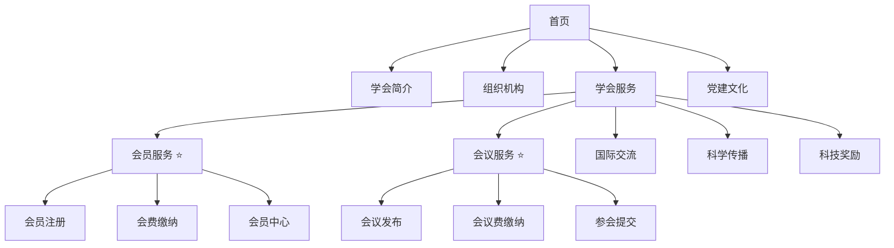

# 中国古生物学会网站完整需求规格文档

> **版本：** V1.0  
> **日期：** 2026-05-29  
> **核心模块：** 会员服务 · 党建文化  

---

## 目录

1. [项目概述](#1-项目概述)
2. [网站整体导航架构](#2-网站整体导航架构)
3. [模块一：首页](#3-模块一首页)
4. [模块二：学会简介](#4-模块二学会简介)
5. [模块三：组织机构（专业分会）](#5-模块三组织机构专业分会)
6. [模块四：学会服务](#6-模块四学会服务)
   - [6.1 会员服务（核心）](#61-会员服务核心)
   - [6.2 会议服务（核心）](#62-会议服务核心)
   - [6.3 国际交流](#63-国际交流)
   - [6.4 科学传播](#64-科学传播)
   - [6.5 科技奖励](#65-科技奖励)
7. [模块五：党建文化（核心）](#7-模块五党建文化核心)
8. [会员费·会议费·参会提交——业务流程详解](#8-会员费会议费参会提交业务流程详解)
   - [8.1 账号体系](#81-账号体系)
   - [8.2 会员费缴纳流程](#82-会员费缴纳流程)
   - [8.3 会议费缴纳流程](#83-会议费缴纳流程)
   - [8.4 参会信息提交流程](#84-参会信息提交流程)
   - [8.5 状态流转总图](#85-状态流转总图)
9. [消息通知系统](#9-消息通知系统)
10. [文件管理系统](#10-文件管理系统)
11. [后台管理系统](#11-后台管理系统)
    - [11.1 管理架构概述](#111-管理架构概述)
    - [11.2 管理员账号](#112-管理员账号)
    - [11.3 CMS内容管理——前端页面如何更新](#113-cms-内容管理前端页面如何更新)
    - [11.4 功能数据管理——交互流程如何运转](#114-功能数据管理交互流程如何运转)
    - [11.5 权限体系](#115-权限体系)
    - [11.6 操作日志](#116-操作日志)
    - [11.7 缓存策略](#117-缓存策略)
12. [数据统计与导出](#12-数据统计与导出)
13. [待确认问题与风险提示](#13-待确认问题与风险提示)
14. [页面视觉与素材参考](#14-页面视觉与素材参考)

---

## 1. 项目概述

### 1.1 项目背景

中国古生物学会及其下属11个专业分会需建设统一的新网站及会员管理系统，以支撑学会日常运营，重点解决以下问题：

- 会员注册、会费缴纳、会员资格管理的线上化
- 学术会议从发布到参会报名的全流程管理
- 党建文化内容的规范化展示与维护
- 满足审计整改要求，实现财务对账清晰可追溯

### 1.2 核心设计原则

| 原则 | 说明 |
|------|------|
| **单账号全局通用** | 一个邮箱对应一个账号，全站所有分会通用 |
| **权限隔离** | 分会A的会员仅能访问分会A的会议和资源 |
| **单次缴费** | 会员费、会议注册费均只能单笔单次缴纳（符合财务审核要求） |
| **智能+人工审核** | 凭证和发票上传后，先智能识别，再人工审核 |
| **最新版本原则** | 参会信息和摘要文件只保留最后一次更新版本 |
| **自动通知** | 所有关键操作自动触发站内通知+邮件通知 |

### 1.3 模块总览



---

## 2. 网站整体导航架构

### 一级导航

```
首页 | 学会简介 | 组织机构 | 学会服务 | 党建文化
```

### 二级结构总览

```
首页
├── 新闻动态
├── 通知公告
├── 学术活动
└── 会员登录入口

学会简介
├── 学会概况
├── 学会章程
├── 现任领导
├── 历任领导
├── 理事会
├── 监事会
├── 秘书处
├── 专业分会（11个分会列表）
├── 历史沿革
├── 历史相册
├── 发展规划
└── 获奖成果

组织机构
├── 左侧：11个专业分会入口
└── 右侧：组织机构图 · 管理系列

    [每个分会独立页面]
    ├── 分会首页（重大科研进展）
    ├── 分会概况
    ├── 理事会
    ├── 工作动态
    ├── 通知公告
    ├── 历史沿革
    ├── 历史相册
    ├── 科学传播（学术专著/科普读物/科普文章/科普视频/科普基地/化石保护）
    ├── 获奖成果
    └── 下载中心（会议简讯/论文摘要集/入会申请表/用印审批表等）

学会服务
├── 会员服务 ⭐
├── 会议服务 ⭐
├── 国际交流
│   ├── 交流动态
│   ├── 国际会议
│   ├── 国际会议组织
│   └── 国际会议合作机构
├── 科学传播
│   ├── 工作动态
│   ├── 期刊服务
│   ├── 科普基地
│   ├── 科普文章
│   ├── 科普视频
│   └── 化石保护
└── 科技奖励

党建文化 ⭐
├── 通知公告
├── 党群机构
├── 党委纪委
├── 党建工作
├── 组织生活
├── 党员队伍建设
├── 理论学习专栏
├── 工作动态
├── 党建专题
├── 先进典型
├── 违法违纪举报
└── 下载中心
```

---

## 3. 模块一：首页

### 3.1 布局参考

整体布局参考中国环境科学学会官网风格，包含：

| 区域 | 内容 |
|------|------|
| 顶部导航 | Logo + 一级菜单 + 登录/注册入口 |
| Banner区 | 轮播大图（学会重大活动、学术会议） |
| 新闻动态 | 学会要闻列表（图文混排） |
| 通知公告 | 最新通知列表（标题+日期） |
| 学术活动 | 近期会议卡片 |
| 快速入口 | 会员注册、会费缴纳、会议报名 |
| 分会导航 | 11个分会快捷入口 |
| 底部 | 版权信息、联系方式、友情链接 |

### 3.2 登录状态

- **未登录：** 右上角显示【登录】【注册】
- **已登录：** 右上角显示用户姓名 + 消息红点 +【个人中心】

---

## 4. 模块二：学会简介

以静态内容展示为主，子栏目结构：

```
学会简介
├── 学会概况          → 富文本页面，学会基本信息介绍
├── 学会章程          → 富文本页面，章程全文
├── 现任领导          → 姓名、照片、职务、简介
├── 历任领导          → 姓名、照片、任期、简介
├── 理事会            → 理事会成员列表（姓名、单位、职务）
├── 监事会            → 监事会成员列表
├── 秘书处            → 秘书处组成及职责
├── 专业分会          → 11个分会的列表（名称+简介+链接）
├── 历史沿革          → 学会发展历程时间线
├── 历史相册          → 图片相册（活动/会议/考察等历史照片）
├── 发展规划          → 富文本页面
└── 获奖成果          → 获奖列表（年份、奖项名称、获奖人/单位）
```

> **后台需求：** 以上所有子栏目支持内容编辑、图片替换。

---

## 5. 模块三：组织机构（专业分会）

### 5.1 页面布局

左右双栏布局：

- **左侧栏：** 11个专业分会列表（名称 + 图标/缩略图），点击进入对应分会独立页面
- **右侧栏：** 学会整体组织机构图 + 管理系列架构图

### 5.2 分会独立页面

每个分会拥有独立的子站点（11套，结构相同、数据独立）：

| 栏目 | 说明 | 内容类型 |
|------|------|----------|
| 分会首页 | 重大科研进展、分会动态 | 新闻列表 |
| 分会概况 | 分会介绍 | 富文本 |
| 理事会 | 分会理事会成员 | 人员列表 |
| 工作动态 | 分会日常活动新闻 | 新闻列表 |
| 通知公告 | 分会专属通知 | 公告列表 |
| 历史沿革 | 分会发展历史 | 富文本 |
| 历史相册 | 分会历史照片 | 图片相册 |
| 科学传播 | 学术专著/科普读物/文章/视频/基地/化石保护 | 多tab内容 |
| 获奖成果 | 分会获奖记录 | 列表 |
| 下载中心 | 会议简讯/论文摘要集/入会申请表/用印审批表 | 文件下载 |

### 5.3 权限规则

- 分会首页的**通知公告**在全站首页可见标题，但附件（会议通知PDF、摘要模板）**仅该分会有效会员可下载**（会员费审核通过）
- **全站首页的通知公告不提供附件下载入口**，用户需进入对应分会页面下载
- **非会员、已过期会员：** 仅可查看公开信息，不可下载附件

---

## 6. 模块四：学会服务

### 6.1 会员服务（核心）

会员服务是整个系统的核心模块，包含以下子功能：

#### 6.1.1 会员注册

```
注册流程：
邮箱注册 → 填写个人信息 → 提交 → 注册成功 → 跳转登录
```

| 字段 | 说明 |
|------|------|
| 邮箱 | 必填，不可修改，全局唯一 |
| 密码 | 必填，6位以上 |
| 确认密码 | 必填，需一致 |
| 姓名 | 必填，实名制 |
| 性别 | 必填，单选 |
| 单位 | 必填 |
| 职务信息 | 选填：学生 / 老师 / 其他 / 职称 |

#### 6.1.2 个人中心

- 显示个人信息（邮箱不可编辑，其余可修改）
- 修改密码需输入原密码
- 我的分会列表（按状态分组）
- 我的会议列表
- 缴费记录（会员费 + 会议费，两个标签页）
- 消息中心

#### 6.1.3 分会加入与会费缴纳

详见 [§8.2 会员费缴纳流程](#82-会员费缴纳流程)

#### 6.1.4 会员状态

| 状态 | 页面显示 | 可操作 |
|------|----------|--------|
| 未申请 | 灰色【申请加入】 | 申请 |
| 审核中 | 灰色"审核中" | 等待 |
| 已驳回 | 红色"已驳回"+ 原因 | 重新提交 |
| 有效会员 | 绿色"有效期至 YYYY-MM-DD" | 续费 |
| 已过期 | 黄色"已过期" | 续费 |

---

### 6.2 会议服务（核心）

#### 6.2.1 会议发布

- 中国古生物学会及各分会可在各自页面独立发布会议
- **权限规则：** 
  - **推送层：** 会议发布后自动推送给该分会所有会员（含未缴费会员），告知会议存在
  - **访问层：** 仅该分会有效会员（会员费审核通过）可查看会议详情页内容；未缴费会员点击通知后显示"仅有效会员可查看"提示
  - **附件下载：** 需有效会员（会员费审核通过）
  - **缴费注册：** 需已上传会员费缴费凭证

#### 6.2.2 会议内容

每个会议包含：

| 内容 | 说明 |
|------|------|
| 会议通知详情 | 富文本内容，会议时间、地点、主题等 |
| 通知PDF附件 | 仅有效会员可下载（会员费审核通过） |
| 摘要模板附件 | 仅有效会员可下载（会员费审核通过） |
| 野外路线信息 | 仅提供旅游公司通知公告和联系方式（不设线上收费） |
| 注册费信息 | 学生/教师/嘉宾三类收费标准 |
| 缴费截止日期 | 超时不可提交 |

#### 6.2.3 会议状态

| 状态 | 显示 | 触发条件 |
|------|------|----------|
| 报名中 | 正常展示，可缴费 | 会议发布后至截止日期前 |
| 已截止 | "缴费已截止" | 超过缴费截止日期 |
| 进行中 | 会议日期范围内 | — |
| 已结束 | "已结束"，归入历史会议 | 会议日期过后 |

#### 6.2.4 用户侧会议卡片

用户登录后在首页/分会页面看到所属学会的会议卡片：

| 卡片状态 | 标签颜色 | 可操作 |
|----------|----------|--------|
| 未缴费 | 默认 | 缴纳会议注册费 |
| 待审核 | 黄色 | 等待 |
| 初审通过 | 蓝色 | 上传发票 / 填写参会信息 |
| 审核通过 | 绿色 | 填写/修改参会信息 |
| 已截止 | 灰色 | 不可操作 |
| 已结束 | 灰色 | 查看历史 |

---

### 6.3 国际交流

| 子栏目 | 说明 |
|--------|------|
| 交流动态 | 国际学术交流活动新闻 |
| 国际会议 | 国际会议信息发布 |
| 国际会议组织 | 学会参与的 international 组织介绍 |
| 国际会议合作机构 | 合作机构列表与链接 |

### 6.4 科学传播

| 子栏目 | 说明 |
|--------|------|
| 工作动态 | 科普工作新闻更新 |
| 期刊服务 | 学会主办/协办期刊介绍与链接 |
| 科普基地 | 科普教育基地列表 |
| 科普文章 | 科普文章发布 |
| 科普视频 | 视频内容嵌入 |
| 化石保护 | 化石保护政策、法规、工作 |

### 6.5 科技奖励

- 奖项介绍
- 获奖名单公示
- 申报指南
- 历届获奖成果展示

---

## 7. 模块五：党建文化（核心）

> **审计整改重点关注模块。** 此模块要求结构严谨、内容规范、更新及时。

### 7.1 通知公告

发布内容类型：
- 上级党组织重要批示指示
- 巡视巡察公告
- 党内选举公告
- 党务正式通知
- 各类公示文件

### 7.2 党群机构

展示学会完整党群组织体系，下设独立详情页：

```
党群机构
├── 党群工作处    → 职能与架构
├── 党支部委员会  → 成员与分工
├── 工会          → 工会组织与活动
└── 共青团委员会  → 团委组织与活动
```

### 7.3 党委纪委

专项展示：
- 党委履职工作
- 纪委监督职责
- 党风廉政建设统筹工作

### 7.4 党建工作

集中展示：
- 年度党建工作要点
- 阶段性党建任务
- 工作部署
- 专项整治
- 党建责任制落实情况

### 7.5 组织生活

#### 换届选举

- 换届时限、工作流程、补选、差额选举规范
- 配套官方文件、表格模板下载

#### 常态化组织生活

| 类别 | 说明 |
|------|------|
| 三会一课 | 支部党员大会、支委会、党小组会、党课 |
| 主题党日 | 活动纪实 |
| 组织生活会 | 会议记录 |
| 中心组学习 | 学习纪要 |
| 民主生活会 | 活动纪实 |
| 民主评议党员 | 评议记录 |

每类事项独立页面，可发布活动纪实、会议记录、工作新闻。

### 7.6 党员队伍建设

```
党员队伍建设
├── 党员队伍概况    → 学会党员总体结构、队伍基本情况
├── 发展党员        → 工作细则、入党及转正材料模板、发展公示、转正公示
├── 党员教育        → 红色基地研学、廉政教育、主题教育活动新闻纪实
├── 党员管理        → 组织关系转移流程、民主评议原则与步骤、日常管理制度
├── 党员服务        → 困难党员帮扶、暖心服务工作成效
├── 党员奖惩        → 志愿服务、先锋事迹、评优评先表彰
└── 党费管理        → 收缴使用管理规定、分级收费标准、月度收缴台账、年度统计公示
```

### 7.7 理论学习专栏

| 子栏目 | 说明 |
|--------|------|
| 权威学习数据库 | 外链：习近平系列重要讲话数据库、党史学习教育官网、党建资料库、党务书库 |
| 党内重要法规 | 逐条展示，支持详情查阅和官方页面跳转 |
| 基础党务知识 | 党的组织、党员准则、党的纪律等基础常识 |

### 7.8 工作动态

常态化更新各类党建活动、支部工作、党建交流、基层实践等新闻动态（图文形式）。

### 7.9 党建专题

自定义搭建阶段性主题党建专题（如主题教育、党纪学习教育、专项行动等）。

每个专题独立归集：
- 对应学习内容
- 活动动态
- 工作成果

### 7.10 先进典型

| 子栏目 | 说明 |
|--------|------|
| 杰出科学家精神 | 优秀党员科学家事迹、老党员先锋风采、科研报国精神 |
| 重大荣誉 | 七一勋章、优秀共产党员、优秀党务工作者、先进基层党组织、国家荣誉称号等 |

### 7.11 违法违纪举报

- 公示举报渠道
- 举报须知
- 监督规范

### 7.12 下载中心

归集标准化党务模板：
- 入党申请书
- 思想汇报
- 转正申请
- 请假条
- 举报模板等

---

## 8. 会员费·会议费·参会提交——业务流程详解

### 8.1 账号体系

#### 注册规则

```
邮箱注册（全局唯一）
  → 填写实名信息
  → 注册成功
  → 全站通用（一个账号访问所有分会功能）
```

**约束：**
- 一个邮箱 = 一个账号，不可重复注册
- 邮箱不可修改
- 账号可被后台禁用，禁用后无法登录任何功能

---

### 8.2 会员费缴纳流程

#### 流程设计

```
┌─────────┐    ┌──────────┐    ┌──────────┐    ┌──────────┐    ┌──────────┐    ┌──────────┐
│ 选择分会  │ →  │ 确认金额  │ →  │ 线下转账  │ →  │ 上传凭证  │ →   │ 上传发票  │ →  │ 等待审核  │
└─────────┘    └──────────┘    └──────────┘    └──────────┘    └──────────┘    └──────────┘
```

#### 详细步骤

**第1步：选择分会并申请**

- 用户在"分会列表"页面浏览所有启用的分会
- 每个分会卡片显示：名称、介绍、会费金额、有效期（1年）
- 点击【申请加入】进入缴费页
- **限制：一次只能选择一个分会缴费**

**第2步：确认缴费信息**

缴费页面显示：
| 信息 | 说明 |
|------|------|
| 分会名称 | 当前缴费的分会 |
| 会费金额 | 该分会设定的会费（学生/教师/嘉宾统一价） |
| 收款账户 | 户名、账号、开户行 |
| 有效期 | 审核通过后1年 |

**第3步：线下银行转账**

用户根据页面显示的收款账户信息，通过银行柜台或网银完成转账。

**第4步：上传缴费凭证（第一道门禁）**

| 要求 | 说明 |
|------|------|
| 格式 | JPG / PNG |
| 大小 | ≤ 5MB |
| 内容 | 银行转账回执单/截图 |

- 系统对凭证进行**智能识别**（OCR提取金额、收款方、付款方、日期）
- **此步骤完成后，用户可进入会议费注册环节**（会议费缴费不等待会员费审核结果）

**第5步：上传电子发票（第二道门禁）**

| 要求 | 说明 |
|------|------|
| 格式 | JPG / PNG / PDF |
| 大小 | ≤ 10MB |

- 系统对发票进行**智能识别**（OCR提取发票号码、金额、开票方、日期）
- 系统自动**比对**凭证金额与发票金额是否一致
- 比对通过 → 进入人工审核队列
- 比对不通过 → 提示用户重新上传，**暂停会议费注册**

**第6步：财务人工审核**

- 管理员在后台看到待审核列表
- 支持**多选/全选+批量审核**
- 审核通过 → 会员资格生效，有效期从审核通过日起1年
- 审核驳回 → 填写驳回原因，通知用户重新提交

**关键限制规则：**

| 规则 | 说明 |
|------|------|
| 单次缴费 | 一次只能缴纳一个分会的会费 |
| 不可合并 | 会员费和会议费不能合并支付 |
| 凭证先行 | 上传凭证后可进入会议费，上传发票并审核通过后会员才生效 |
| 手动审核 | 所有缴费须经财务人工确认 |

> **⚠️ 问题反馈 #1：** "上传凭证后即可进入会议费注册"与"上传发票审核通过后会员才生效"之间存在时间差。建议明确：会议费注册是否需要会员状态为"已生效"？如果会员费审核被驳回，已缴纳的会议费如何处理？见 [§13 待确认问题](#13-待确认问题与风险提示)。

---

### 8.3 会议费缴纳流程

#### 前置条件

- 用户已上传该分会**会员费缴费凭证**（不要求会员费已审核通过，但若会员费发票核对不通过，会议费注册将被停止）
- 会议在缴费截止日期前

#### 流程设计

```
┌─────────┐    ┌──────────┐    ┌──────────┐    ┌──────────┐    ┌──────────┐    ┌──────────┐    ┌──────────┐
│ 选择会议 │ →  │ 选择身份  │ →  │ 确认金额  │ →  │ 线下转账  │ →  │ 上传凭证  │ →  │ 上传发票  │ →  │ 等待审核  │
└─────────┘    └──────────┘    └──────────┘    └──────────┘    └──────────┘    └──────────┘    └──────────┘
```

#### 详细步骤

**第1步：选择会议**

- 用户只能看到已加入分会（含未缴费会员）的会议；下载附件需有效会员
- 未读会议有红点标记
- 点击进入会议详情页

**第2步：选择身份与金额**

会议注册费分三类：

| 身份 | 说明 |
|------|------|
| 学生 | 学生注册费标准 |
| 教师 | 教师注册费标准 |
| 嘉宾 | 嘉宾注册费标准 |

- 身份选择与注册信息一致（学生需验证学生身份）

**第3步：线下银行转账**

**第4步：上传缴费凭证**

- 格式：JPG / PNG，≤ 5MB
- 智能识别后，状态变更为"初审通过：可填写参会信息"

**第5步：上传电子发票（7个工作日内）**

- 格式：JPG / PNG / PDF，≤ 10MB
- 需在**凭证上传后7个工作日内**完成发票上传
- 超时未上传 → 系统提醒，可申请延期
- 智能识别+比对通过 → 进入人工审核

**第6步：财务审核**

- 审核通过 → 获得参会资格
- 审核驳回 → 填写原因，用户重新提交

**关键限制规则：**

| 规则 | 说明 |
|------|------|
| 前置条件 | 已上传会员费缴费凭证 |
| 单次缴费 | 一次只能缴纳一个会议的注册费 |
| 截止日期 | 超时不可提交，按钮置灰 |
| 发票时限 | 凭证上传后7个工作日内上传发票 |
| 独立审核 | 每个会议独立审核，互不影响 |

> **⚠️ 问题反馈 #2：** 会议的三类收费标准需要在后台会议设置中分别配置。需确认：嘉宾是否有不同于教师的标准？学生身份如何验证（学生证上传？邮箱后缀？）？见 [§13](#13-待确认问题与风险提示)。

---

### 8.4 参会信息提交流程

#### 前置条件

会议费**初审通过**（即已上传会议费缴费凭证）。

#### 页面表单

##### 基础信息区

| 字段 | 类型 | 规则 |
|------|------|------|
| 姓名 | 文本 | 必填，可自动读取实名信息 |
| 性别 | 单选项 | 必填：男 / 女 |
| 单位 | 文本 | 必填 |
| 身份 | 单选项 | 必填：教师 / 学生 / 嘉宾 |

##### 住宿统计区

| 字段 | 类型 | 规则 |
|------|------|------|
| 住宿选择 | 单选项 | 必填：单间 / 双人间 / 自行安排 |

##### 学术分会场

| 字段 | 类型 | 规则 |
|------|------|------|
| 分会场 | 单选项 | 必填：无专场 / 01专场：XXX / 02专场：XXX / …（后台可编辑） |

##### 报告类型区

| 字段 | 类型 | 规则 |
|------|------|------|
| 报告类型 | 单选项 | 必填：口头报告 / 展板报告 / 仅参会 |

- 选择"口头报告"或"展板报告"时，显示【报告标题】输入框（必填）
- 选择"仅参会"时，报告标题隐藏

##### 学术摘要区

| 要求 | 说明 |
|------|------|
| 格式 | .doc / .docx |
| 大小 | ≤ 10MB |
| 保留版本 | 仅保留最后一次上传的版本 |

- 显示当前已上传的摘要文件名
- 按钮：【删除旧摘要】【上传新摘要】
- 上传新文件后自动替换旧文件
- 摘要修改有**截止日期**（后台设置），超时不可修改

#### 修改规则

- 参会信息可**无限次修改**
- 每次提交/修改后自动发送邮件通知
- 系统只保留最后一次更新版本
- 一个用户一场会议只有一条参会信息记录
- 后台导出永远是最新版本

#### 后台实时统计

| 统计项 | 内容 |
|--------|------|
| 参会统计 | 总会员数、报告会员数、口头报告数、展板报告数 |
| 住宿统计 | 男单间×N、男双人间×N、女单间×N、女双人间×N |
| 摘要导出 | 按分会场顺序分别导出；无分会场的直接导出 |

> **⚠️ 问题反馈 #3：** 住宿统计需要性别+房型交叉统计，表单中性别和住宿选择是分开的字段，后台需做交叉统计。另外，双人间是否需要配对（同住人信息）？目前设计未包含此字段。见 [§13](#13-待确认问题与风险提示)。

---

### 8.5 状态流转总图

#### 会员完整生命周期

```
用户注册
  → 选择分会，申请加入
  → 线下转账
  → 上传缴费凭证（OCR识别）
  → 上传电子发票（OCR识别+比对）
  → 财务审核
      ├── 通过 → 会员生效（有效期1年）→ 可参加该分会会议
      └── 驳回 → 重新提交
  → 到期 → 续费或失效
```

#### 会议参会完整生命周期

```
分会发布会议 → 自动推送给该分会所有会员
  → 所有会员查看会议详情；有效会员下载附件；已上传凭证用户缴纳会议费
  → 选择身份，转账
  → 上传缴费凭证（OCR识别）→ 初审通过 → 可填写参会信息
  → 上传电子发票（7工作日内）→ OCR识别+比对
  → 财务审核
      ├── 通过 → 完成会议费缴纳
      └── 驳回 → 重新提交
  → 参会信息 + 摘要可修改至截止日期
  → 会议结束后归入历史
```

---

## 9. 消息通知系统

### 9.1 站内通知

| 触发时机 | 通知内容 |
|----------|----------|
| 新会议发布 | "您所属的XX分会发布了新会议：《会议名称》" |
| 会员费审核通过 | "您在XX分会的会员费已审核通过，有效期至YYYY-MM-DD" |
| 会员费审核驳回 | "您在XX分会的会员费审核被驳回，原因：XXX" |
| 会议费审核通过 | "您参加的《会议名称》注册费已审核通过" |
| 会议费审核驳回 | "您参加的《会议名称》注册费审核被驳回，原因：XXX" |
| 参会信息提交成功 | "您的参会信息已提交成功" |
| 参会信息更新成功 | "您的参会信息已更新" |
| 会议缴费即将截止 | 截止前7天、3天各一次 |
| 会员费即将到期 | 到期前30天、7天各一次 |

**展示位置：**
- 首页右上角铃铛图标 + 未读数字红点
- "我的消息中心"页面（全部消息列表）
- 对应功能页面的内联状态提示

### 9.2 邮件通知

邮件模板列表（共10种）：

| # | 模板名称 |
|---|----------|
| 1 | 注册成功通知 |
| 2 | 会员费审核通过通知 |
| 3 | 会员费审核驳回通知 |
| 4 | 会议注册费审核通过通知 |
| 5 | 会议注册费审核驳回通知 |
| 6 | 参会信息提交成功通知 |
| 7 | 参会信息更新成功通知 |
| 8 | 会议缴费截止提醒 |
| 9 | 会员费到期提醒 |
| 10 | 密码重置通知 |

**发送规则：**
- 自动发送至用户注册邮箱
- 发送失败自动重试3次
- 后台可查发送日志

---

## 10. 文件管理系统

### 10.1 文件类型

| 文件类型 | 支持格式 | 大小限制 | 存储位置 |
|----------|----------|----------|----------|
| 缴费凭证 | JPG / PNG | ≤ 5MB | 服务器 |
| 电子发票 | JPG / PNG / PDF | ≤ 10MB | 服务器 |
| 会议通知 | PDF / DOC / DOCX | ≤ 20MB | 服务器 |
| 摘要模板 | DOC / DOCX | ≤ 10MB | 服务器 |
| 用户摘要 | DOC / DOCX | ≤ 10MB | 服务器 |
| 党建文档 | PDF / DOC / DOCX / XLS | ≤ 20MB | 服务器 |

### 10.2 上传规则

- 前端使用 FormData 上传
- 后端校验格式和大小
- 文件命名：`类型_用户ID_时间戳.后缀`
- 路径存入数据库

### 10.3 下载权限（核心安全）

```
用户请求下载
  → 校验登录状态
  → 校验权限：
      - 分会附件：必须为该分会有效会员（会员费审核通过）
      - 自己的凭证/发票/摘要：登录即可
      - 党建文件：登录即可（特定文件可能需党员身份）
  → 通过 → 返回文件流
  → 不通过 → 返回403
```

### 10.4 文件替换与清理

| 操作 | 处理 |
|------|------|
| 用户上传新文件 | 自动删除旧文件 |
| 用户删除摘要 | 物理删除服务器文件 |
| 后台删除会议/分会 | 级联删除相关文件 |

---

## 11. 后台管理系统

### 11.1 管理架构概述

#### 核心架构分层

整体分为三层，自顶向下：

```
┌─────────────────────────────────────────────────────────────────┐
│                    后台管理系统（业务入口）                        │
│                                                                 │
│  ┌─────────────────────────┐  ┌─────────────────────────────┐  │
│  │     CMS 内容引擎          │  │     功能数据管理              │  │
│  │  负责网站/平台的内容维护    │  │  负责组织与业务数据的运营管理   │  │
│  │                         │  │                             │  │
│  │  · 栏目管理              │  │  · 分会管理                  │  │
│  │  · 文章发布              │  │  · 会议管理                  │  │
│  │  · 富文本编辑            │  │  · 会员管理                  │  │
│  │  · 媒体库管理            │  │  · 缴费审核                  │  │
│  │                         │  │  · 数据统计 / 导出           │  │
│  │                         │  │  · 系统配置                  │  │
│  │                         │  │  · 权限管理                  │  │
│  └────────────┬────────────┘  └──────────────┬──────────────┘  │
│               │                              │                  │
└───────────────┼──────────────────────────────┼──────────────────┘
                │                              │
                ▼                              ▼
┌─────────────────────────────────────────────────────────────────┐
│                      数据库（数据存储层）                         │
│                                                                 │
│  内容表  │  用户表  │  分会表  │  缴费表  │  会议表  │  日志表    │
│                                                                 │
└─────────────────────────────────────────────────────────────────┘
```

#### 模块关系

- CMS 内容引擎和功能数据管理模块，都直接与数据库交互
- CMS 内容引擎 → 支撑前端内容展示（学会简介、党建文化、分会页面等）
- 功能数据管理 → 支撑会员、会议、缴费等核心业务流程
- 数据统一存储在数据库中，实现内容与业务数据的一体化管理

### 11.2 管理员账号

| 类型 | 数量 | 权限范围 |
|------|------|----------|
| 学会总管理员 | 5个 | 全站所有功能（含CMS全栏目 + 所有分会数据） |
| 分会管理员 | 各2个 | 仅管理所属分会（CMS仅分会页面 + 仅本分会数据） |

---

### 11.3 CMS 内容管理——前端页面如何更新

#### 11.3.1 CMS 覆盖的页面范围

CMS 负责所有**内容展示型页面**的增删改。管理后台编辑后，前端页面实时生效。

| 前端页面/栏目 | CMS后台入口 | 管理操作 | 存储方式 |
|--------------|------------|----------|----------|
| **首页** Banner | 系统设置 → 首页管理 | 上传轮播图、设置链接 | 媒体库+配置表 |
| **首页** 新闻动态 | 内容管理 → 新闻管理 | 发布/编辑/置顶/删除 | 文章表 |
| **首页** 通知公告 | 内容管理 → 公告管理 | 发布/编辑/下架 | 文章表 |
| **首页** 快速入口 | 系统设置 → 首页管理 | 配置入口文字和链接 | 配置表 |
| **学会概况** | 学会简介 → 概况 | 富文本编辑 | 内容表 |
| **学会章程** | 学会简介 → 章程 | 富文本编辑 | 内容表 |
| **现任领导** | 学会简介 → 领导管理 | 增删改（姓名/照片/职务/简介） | 人员表 |
| **历任领导** | 学会简介 → 领导管理 | 增删改（+任期字段） | 人员表 |
| **理事会/监事会** | 学会简介 → 成员管理 | 列表增删改 | 人员表 |
| **秘书处** | 学会简介 → 秘书处 | 富文本+名单 | 内容表 |
| **专业分会列表** | 学会简介 → 分会列表 | 编辑介绍文案（分会本身在功能模块管） | 内容表 |
| **历史沿革** | 学会简介 → 沿革 | 富文本编辑 | 内容表 |
| **历史相册** | 学会简介 → 相册 | 上传/排序/删除照片 | 媒体库 |
| **发展规划** | 学会简介 → 规划 | 富文本编辑 | 内容表 |
| **获奖成果** | 学会简介 → 获奖 | 增删改（年份/奖项/获奖人） | 列表表 |
| **组织机构图** | 组织机构 → 架构图 | 上传图片/编辑文字 | 媒体库+内容表 |
| **11个分会独立页面** | 分会管理 → 选分会 → 内容 | 同"学会简介"结构，数据按分会隔离 | 分会内容表 |
| **国际交流** | 学会服务 → 国际交流 | 各子栏目文章发布+富文本 | 文章表 |
| **科学传播** | 学会服务 → 科学传播 | 各子栏目文章发布+富文本+视频嵌入 | 文章表 |
| **科技奖励** | 学会服务 → 科技奖励 | 文章发布+富文本 | 文章表 |
| **党建-通知公告** | 党建文化 → 通知公告 | 文章发布 | 文章表 |
| **党建-党群机构** | 党建文化 → 党群机构 | 富文本+人员列表 | 内容表+人员表 |
| **党建-党委纪委** | 党建文化 → 党委纪委 | 富文本编辑 | 内容表 |
| **党建-党建工作** | 党建文化 → 党建工作 | 文章发布+富文本 | 文章表 |
| **党建-组织生活** | 党建文化 → 组织生活 | 各子类文章发布（活动纪实/会议记录） | 文章表 |
| **党建-党员队伍建设** | 党建文化 → 队伍建设 | 各子栏目富文本+文档上传 | 内容表+文件表 |
| **党建-理论学习** | 党建文化 → 理论学习 | 外链管理+法规文本 | 链接表+内容表 |
| **党建-工作动态** | 党建文化 → 工作动态 | 文章发布（图文新闻） | 文章表 |
| **党建-党建专题** | 党建文化 → 党建专题 | 创建专题→归集文章/活动/成果 | 专题表+关联表 |
| **党建-先进典型** | 党建文化 → 先进典型 | 文章发布+人物事迹 | 文章表 |
| **党建-违法违纪举报** | 党建文化 → 举报 | 富文本（渠道/须知/规范） | 内容表 |
| **党建-下载中心** | 党建文化 → 下载 | 文件上传+分类管理 | 文件表 |
| **底部信息** | 系统设置 → 站点信息 | 版权/联系方式/友情链接 | 配置表 |

#### 11.3.2 CMS 编辑器功能

后台富文本编辑器需支持：

| 功能 | 说明 |
|------|------|
| 文字排版 | 字体、大小、颜色、加粗、斜体、对齐 |
| 图片插入 | 从媒体库选择或本地上传，支持拖拽调整大小 |
| 附件插入 | 上传文件并生成下载链接（PDF/DOC等） |
| 外链 | 插入超链接，支持新窗口打开 |
| 视频嵌入 | 支持腾讯视频/优酷/B站等平台嵌入代码 |
| 表格 | 插入和编辑表格 |
| 源码模式 | 可切换到HTML源码编辑 |
| 预览 | 发布前预览效果 |

#### 11.3.3 媒体库

统一管理全站图片和附件：

```
媒体库
├── 首页Banner图
├── 新闻配图
├── 学会简介配图
├── 历史相册
├── 分会页面配图
├── 党建配图
├── 党建文档（入党申请书模板等）
└── 通用附件
```

- 支持分类、搜索、批量上传
- 图片上传自动压缩缩略图
- 记录文件被哪些页面引用，防止误删

---

### 11.4 功能数据管理——交互流程如何运转

#### 11.4.1 功能模块覆盖范围

这些模块不通过CMS管理，而是直接操作数据库：

| 后台功能 | 操作 | 数据影响 | 前端如何体现 |
|----------|------|----------|-------------|
| **分会设置** | 新增/编辑/禁用分会 | 分会表 | 前端分会列表实时更新，禁用分会立即隐藏 |
| **分会会费配置** | 设置会费金额 | 分会表.fee字段 | 用户缴费页显示最新金额 |
| **会议发布** | 创建会议、填信息、设注册费、传附件、设截止日期 | 会议表+附件表 | 会员端会议卡片自动出现，含完整信息 |
| **分会场设置** | 添加/编辑/删除分会场选项（01专场：XXX） | 分会场表 | 参会信息页下拉选项动态变化 |
| **缴费审核** | 查看凭证+发票，批量通过/驳回/写原因 | 缴费记录表.status | 会员端状态实时刷新，触发邮件通知 |
| **摘要截止设置** | 设置修改截止日期 | 会议表.abstract_deadline | 超时后前端上传按钮置灰 |
| **会员查询** | 按邮箱/姓名搜索 | —（只读） | — |
| **账号管理** | 禁用/启用会员账号 | 用户表.status | 禁用后该用户无法登录 |
| **手动开通会员** | 为指定用户开通某分会会员资格 | 会员表 | 用户获得会员权限，无需走缴费流程 |
| **数据导出** | 按条件导出Excel | —（只读） | — |
| **统计面板** | 查看实时数据 | —（只读聚合查询） | — |

#### 11.4.2 审核工作流

```
缴费申请提交 → 系统OCR预处理 → 进入审核队列
                                 ↓
                          管理员查看列表
                          （凭证+发票并排预览）
                                 ↓
                    ┌───── 多选记录 ─────┐
                    ↓                    ↓
              【批量通过】           【批量驳回】
                    ↓                    ↓
              状态更新+通知          填写驳回原因+通知
```

审核列表功能：
- 筛选：按分会/会议/状态/日期
- 排序：按提交时间、金额
- 预览：点击查看凭证和发票原图
- 选中：复选框多选/全选当前页
- 一键操作：批量通过/批量驳回
- 驳回弹窗：文本框填写原因（必填）

---

### 11.5 权限体系

#### 11.5.1 角色定义

| 角色 | 人数 | CMS权限 | 功能数据权限 | 系统权限 |
|------|------|---------|-------------|----------|
| **学会总管理员** | 5 | 全站所有栏目 | 所有分会全部数据 | 管理员账号管理、系统配置 |
| **分会管理员** | 每分会2人 | 仅所属分会独立页面 | 仅所属分会的会员/缴费/会议数据 | 无 |
| **财务审核员** | 待定 | 无 | 所有分会的缴费审核（只审不导出） | 无 |

#### 11.5.2 数据隔离规则

分会管理员登录后：
- 只能看到自己分会的会员列表
- 只能审核自己分会的缴费
- 只能管理自己分会的会议
- 只能编辑自己分会的CMS内容
- 学会级别的数据（学会简介/首页/党建等）只读

---

### 11.6 操作日志

所有后台操作需记录日志，便于追溯和审计：

| 记录内容 | 说明 |
|----------|------|
| 操作人 | 管理员账号 |
| 操作时间 | 精确到秒 |
| 操作类型 | 新增/编辑/删除/审核/导出 |
| 操作对象 | 哪个模块、哪条数据 |
| 操作详情 | 修改了哪些字段、审核结果、导出范围 |
| IP地址 | 操作时的IP |

**审计相关操作必记：**
- 缴费审核（通过/驳回）
- 手动开通会员资格
- 账号禁用/启用
- 会议信息修改
- 数据导出

---

### 11.7 缓存策略

| 数据类型 | 缓存策略 | 更新触发 |
|----------|----------|----------|
| CMS内容（学会简介、分会介绍等） | 发布时缓存，有效期24h | 后台编辑保存时立即刷新 |
| 新闻列表/公告列表 | 缓存5分钟 | 新文章发布时刷新 |
| 会员状态 | **不缓存**，实时查询 | — |
| 缴费状态 | **不缓存**，实时查询 | — |
| 会议列表 | 缓存10分钟 | 新会议发布/编辑时刷新 |
| 统计面板 | 缓存30分钟，定时计算 | 手动刷新按钮可强制更新 |
| 党建内容 | 同CMS内容策略 | 编辑保存时刷新 |

---

## 12. 数据统计与导出

### 12.1 实时统计面板

#### 会员费统计

| 指标 | 维度 |
|------|------|
| 各分会当年会员总人数、已缴费人数、会费笔数 | 按分会 |
| 累计会员总人数（去重）、累计会费总额、累计会费笔数 | 按分会 |
| 按身份类别：学生（笔数+金额）、教师（笔数+金额）、嘉宾（笔数+金额） | 按分会 |

#### 会议费统计

| 指标 | 维度 |
|------|------|
| 各分会当年会议参会人数、单次缴费人数、会议费笔数 | 按分会 |
| 累计会议参会总人数（去重）、累计会议费总额、累计会议费笔数 | 按分会 |
| 按身份类别：学生（笔数+金额）、教师（笔数+金额）、嘉宾（笔数+金额） | 按会议 |

#### 参会统计

| 指标 | 维度 |
|------|------|
| 参会总人数、报告人数 | 按会议 |
| 口头报告数、展板报告数 | 按会议 |
| 住宿：男单间×N、男双人间×N、女单间×N、女双人间×N | 按会议 |

### 12.2 数据导出

| 导出类型 | 筛选条件 | 内容 |
|----------|----------|------|
| 会员导出 | 分会 / 状态 / 时间段 | 会员信息完整列表 |
| 缴费记录导出 | 分会 / 会议 / 时间段 | 缴费记录+状态 |
| 参会人员导出 | 会议 | 参会信息+摘要下载链接 |
| 财务对账导出 | 时间段 / 分会 | 凭证+发票+金额汇总 |

---

## 13. 待确认问题与风险提示

### 13.1 业务流程待确认

| # | 问题 | 影响范围 | 优先级 |
|---|------|----------|--------|
| Q1 | 会员费"上传凭证后可进入会议费注册"，但如果会员费审核被驳回，已缴的会议费如何处理？退款？保留？ | 会员费+会议费联动 | **高** |
| Q2 | 学生身份如何验证？是否需要上传学生证？还是仅靠用户自行声明？ | 会议费差额收费 | **高** |
| Q3 | 会议费发票7个工作日的截止期限，超时后是否有补救机制（如申请延期）？ | 会议费流程 | 中 |
| Q4 | 双人间住宿是否需要填写同住人信息？ | 参会信息 | 低 |
| Q5 | 摘要修改截止日期后，如果有特殊情况（如报告人变更），是否有后台强制覆盖的能力？ | 参会信息 | 低 |
| Q6 | 会员到期后，已报名但未举行的会议参会资格是否保留？ | 会员+会议联动 | **高** |

### 13.2 技术风险提示

| # | 风险 | 说明 | 建议 |
|---|------|------|------|
| R1 | **OCR智能识别** | 缴费凭证和电子发票的OCR识别准确率受图片质量影响大 | 建议接入成熟的第三方OCR服务（如百度OCR/腾讯OCR），并在人工审核环节做兜底 |
| R2 | **实时统计性能** | 多个分会、多年份、交叉维度的实时统计，在大数据量下可能影响页面响应 | 建议使用缓存+定时计算，非实时查询采用准实时方案 |
| R3 | **文件存储容量** | 凭证、发票、摘要长期累积，存储成本增长 | 建议设置归档策略，超过N年的文件迁移至低成本存储 |
| R4 | **11个分会的独立性** | 11套分会页面结构相同但数据完全独立，后台管理逻辑需严格隔离 | 建议在数据库层面用分会ID做数据隔离，避免权限漏洞 |
| R5 | **邮件发送可靠性** | 自建邮件服务可能被邮箱服务商标记为垃圾邮件 | 建议接入企业邮箱或第三方邮件发送服务（如SendCloud） |
| R6 | **线下转账付款方与注册姓名不匹配** | 用户线下银行转账时，付款方名称可能与注册实名不一致（代缴、单位统一汇款、配偶转账等），OCR识别出的付款方与用户实名无法自动匹配，全部流入人工审核 | 审核列表增加"付款方名称"OCR结果列，便于财务比对；高频代缴场景可考虑允许用户备注说明 |

### 13.3 需求合理性建议

| # | 建议 | 原因 |
|---|------|------|
| S1 | 建议将会员费审核和会议费审核的先后顺序解耦 | 当前"凭证-发票"两段式设计可能导致用户困惑。建议简化为：转账→上传凭证+发票→一次性审核 |
| S2 | 建议增加在线支付选项（微信/支付宝） | 线下转账+上传凭证流程繁琐，增加财务人工审核负担。在线支付可自动对账，大幅简化流程 |
| S3 | 建议会议费身份（学生/教师/嘉宾）与注册时填写的职务信息字段联动 | 避免用户选学生价但职务信息不匹配的不一致情况。需注意两者选项不完全一致：职务信息为"学生/老师/其他/职称"，会议费为"学生/教师/嘉宾"。建议联动映射：学生→学生，老师→教师，其他/职称→嘉宾（可改选）。反之，如果会议费选了"教师"但职务信息不是"老师"，可弹窗提醒确认 |
| S4 | 建议党建模块的部分内容（如通知公告、工作动态）复用网站统一的CMS功能 | 避免为党建模块单独开发一套内容管理系统 |
| S5 | 建议采用"缴费时锁定资格"规则：会员到期后，已报名但未举行会议的参会资格保留 | 缴费时满足会员条件即视为有效报名，不因会期前会员到期而追溯取消。避免用户已付费但被拒之门外，也减少退款纠纷。对应 Q6 |

---

## 14. 页面视觉与素材参考

### 14.1 设计风格

- 简洁、专业、学术风格
- 主色调建议：深蓝（#1a3a5c 或类似学术机构常用色）+ 白底
- 字体：系统默认中文字体（苹方/微软雅黑）

### 14.2 背景图片素材

> **暂行方案：** 从南京古生物博物馆网站（http://www.nmp.ac.cn/）获取图片素材。
>
> **限制：** 不使用脊椎动物化石图片（版权归属北京古脊椎动物与古人类研究所）。
>
> **可选素材方向：**
> - 古无脊椎动物化石（三叶虫、菊石、笔石、珊瑚等）
> - 植物化石
> - 微体古生物化石
> - 博物馆建筑外观
> - 博物馆展厅内景
> - 野外地质考察场景
>
> **后续安排：** 邀请博物馆科学传播团队老师参与，最终确定背景图片方案。

### 14.3 素材清单（建议）

| 用途 | 建议素材 | 来源 |
|------|----------|------|
| 首页Banner | 学会重大活动照片 / 博物馆展厅 | nmp.ac.cn |
| 学会简介背景 | 学会历史照片 | 学会档案 |
| 党建文化背景 | 红色主题设计元素（非照片） | 设计提供 |
| 分会页面Banner | 各分会学科相关化石图片 | nmp.ac.cn |
| 登录/注册页背景 | 博物馆建筑 / 展厅 | nmp.ac.cn |

---

> **文档结束。**  
> 此文档整合了网站架构需求和会员管理系统需求，以会员服务和党建文化为核心。  
> 标记为 ⚠️ 的问题需要及时反馈确认，标记为 R 的技术风险需在开发前评估。  
> 标记为 S 的需求建议可根据实际情况讨论是否调整。

---

*本文档将根据反馈持续迭代更新。*
