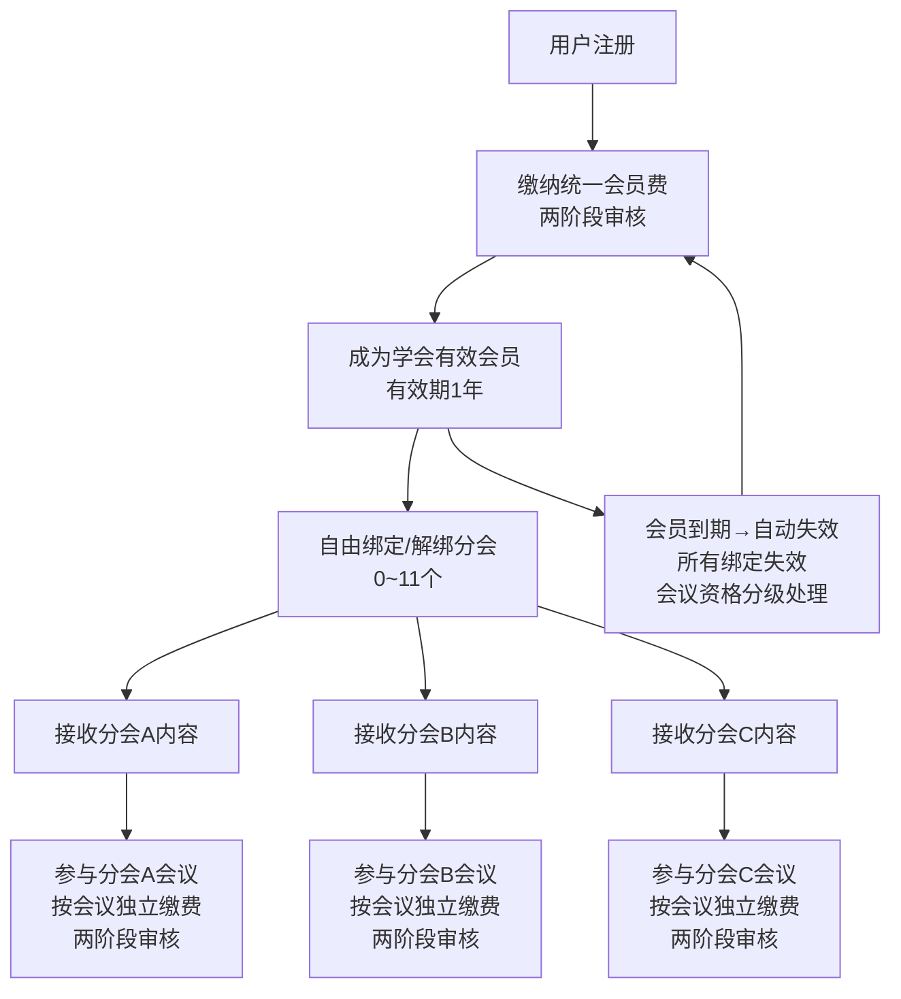

# 中国古生物学会网站完整需求规格文档

> **版本：** 3.0（两阶段审核与规则细化）
> **日期：** 2026-06-10
> **基于：** V2.0 + 修改计划_两阶段审核与规则细化.md（Phase 1-4 全部完成）
>
> **V3 核心变更：**
> 1. 会议费/会员费审核均改为两阶段（凭证初审 → 发票终审），状态从 4 种扩展到 8 种
> 2. 发票从选传改为必传，新增 7 工作日宽限期机制
> 3. 会员到期后会议资格分级处理（保留 / 冻结 / 删除）
> 4. 会员费金额改为后台可配置参数

---

# 第一部分：网站整体架构与内容模块（§1–§13）

> 本部分（§1–§13）与 V2.0 完全一致，无变更。以下为精简目录引用，完整内容见 V2.0 文档。

---

## 目录

1. [项目概述](#1-项目概述)
2. [网站整体导航架构](#2-网站整体导航架构)
3. [模块一：首页](#3-模块一首页)
4. [模块二：学会简介](#4-模块二学会简介)
5. [模块三：组织机构（专业分会）](#5-模块三组织机构专业分会)
6. [模块四：学会服务（核心）](#6-模块四学会服务核心)
   - [6.1 会员服务](#61-会员服务)
   - [6.2 会议服务](#62-会议服务)
   - [6.3 科学传播](#63-科学传播)
   - [6.4 科技奖励](#64-科技奖励)
7. [模块五：党建文化（核心）](#7-模块五党建文化核心)
8. [模块六：学会沿革](#8-模块六学会沿革)
9. [模块七：历史相册](#9-模块七历史相册)
10. [模块八：会员公告](#10-模块八会员公告)
11. [模块九：国际交流](#11-模块九国际交流)
12. [模块十：资料下载](#12-模块十资料下载)
13. [模块十一：规章条例](#13-模块十一规章条例)
14. [统一会员体系·分会绑定·会议费——业务流程详解](#14-统一会员体系分会绑定会议费业务流程详解) ⬅️ **V3 重点更新**
    - [14.1 账号体系](#141-账号体系)
    - [14.2 统一会员费缴纳流程（两阶段审核）](#142-统一会员费缴纳流程两阶段审核)
    - [14.3 分会绑定与管理](#143-分会绑定与管理)
    - [14.4 会议费缴纳流程（两阶段审核）](#144-会议费缴纳流程两阶段审核)
    - [14.5 参会信息提交流程](#145-参会信息提交流程)
    - [14.6 状态流转总图](#146-状态流转总图)
15. [消息通知系统](#15-消息通知系统)
16. [文件管理系统](#16-文件管理系统)
17. [后台管理系统](#17-后台管理系统)
18. [数据统计与导出](#18-数据统计与导出)
19. [待确认问题与风险提示](#19-待确认问题与风险提示)
20. [页面视觉与素材参考](#20-页面视觉与素材参考)
21. [附录：会员费配置与数据模型](#21-附录会员费配置与数据模型)

---

## 1. 项目概述

### 1.1 项目背景

中国古生物学会及其下属11个专业分会需建设统一的新网站及会员管理系统，以支撑学会日常运营，重点解决以下问题：

- 会员注册、会费缴纳、会员资格管理的线上化
- 学术会议从发布到参会报名的全流程管理
- 党建文化内容的规范化展示与维护
- 满足审计整改要求，实现财务对账清晰可追溯

### 1.2 核心设计原则

| 原则 | 说明 |
|------|------|
| **单账号全局通用** | 一个邮箱对应一个账号，全站所有分会通用 |
| **统一会员体系** | 只设一种会员身份——中国古生物学会会员，统一收取会员费 |
| **分会自由绑定** | 会员自由绑定/解绑多个分会（0~11个），绑定后接收该分会内容推送 |
| **权限隔离** | 仅已绑定该分会的有效会员可查看该分会专属会议和内容 |
| **单次缴费** | 会员费统一缴纳一次；会议费按每个会议单笔单次缴纳（符合财务审核要求） |
| **两阶段审核** ⬅️ **V3 新增** | 缴费审核分为凭证初审和发票终审两个阶段，确保财务合规 |
| **智能+人工审核** | 凭证和发票上传后，先智能识别（OCR），再人工审核 |
| **最新版本原则** | 参会信息和摘要文件只保留最后一次更新版本 |
| **自动通知** | 所有关键操作自动触发站内通知+邮件通知 |

### 1.3 整体业务逻辑



---

## 6. 模块四：学会服务

### 6.1 会员服务

#### 6.1.4 会员状态 ⬅️ V3 更新

> **V3 变更：** 会员状态从 5 种扩展为 9 种，体现两阶段审核流程。

| 状态码 | 页面显示 | 颜色 | 可操作 | 说明 |
|--------|----------|------|--------|------|
| `not_member` | "尚未入会" | 灰色 | 申请入会 | 初始状态 |
| `voucher_submitted` | "凭证初审中" | 黄色 | 等待 | 转账凭证已上传，待财务初审 |
| `voucher_rejected` | "凭证被驳回" | 红色 + 原因 | 重新提交凭证 | 凭证初审未通过 |
| `invoice_pending` | "待上传发票" | 蓝色 + 截止日倒计时 | 上传发票 | 初审通过，7工作日内上传发票 |
| `invoice_overdue` | "发票逾期" | 橙色 | 补传发票 | 超过截止日，会员资格锁定 |
| `invoice_submitted` | "发票终审中" | 黄色 | 等待 | 发票已上传，待财务终审 |
| `invoice_rejected` | "发票被驳回" | 红色 + 原因 | 重新提交发票 | 发票终审未通过 |
| `active` | "会员资格有效" | 绿色 + 有效期 | 续费 | 终审通过，有效期1年 |
| `expired` | "已过期" | 灰色 | 续费 | 会员资格到期 |

---

### 6.2 会议服务

#### 6.2.5 用户侧会议卡片 ⬅️ V3 更新

> **V3 变更：** 卡片状态从 6 种扩展为 8 种。

| 卡片状态 | 标签颜色 | 可操作 | 说明 |
|----------|----------|--------|------|
| 未缴费 (`unpaid`) | 灰色 | 缴纳会议注册费 | 尚未开始缴费流程 |
| 凭证初审中 (`voucher_submitted`) | 黄色 | 等待 | 凭证已上传，待财务初审 |
| 凭证被驳回 (`voucher_rejected`) | 红色 | 重新上传凭证 | 凭证初审未通过 |
| 待上传发票 (`invoice_pending`) | 蓝色 + 截止日倒计时 | 填写参会信息 / 上传发票 | 初审通过，可填参会信息 |
| 发票逾期 (`invoice_overdue`) | 橙色 | 补传发票 | 超期未上传，参会信息锁定 |
| 发票终审中 (`invoice_submitted`) | 黄色 | 等待 | 发票已上传，待终审 |
| 发票被驳回 (`invoice_rejected`) | 红色 | 重新上传发票 | 发票终审未通过 |
| 已确认 (`confirmed`) | 绿色 | 修改参会信息 | 终审通过，报名完成 |

---

# 第二部分：核心业务流程详解（§14）⬅️ V3 重点更新

## 14. 统一会员体系·分会绑定·会议费——业务流程详解

### 14.1 账号体系

与 V2.0 一致，无变更。

---

### 14.2 统一会员费缴纳流程（两阶段审核）⬅️ V3 完全重写

#### 核心逻辑

```
用户注册登录
  → 选择【成为会员】
  → 缴纳中国古生物学会统一会员费
  → 【阶段一：凭证初审】
      上传转账凭证 → 财务初审 → 初审通过（可绑定分会）
  → 【阶段二：发票终审】
      上传电子发票（必传）→ OCR比对 → 财务终审 → 成为有效会员（有效期1年）
```

> **V3 核心变更：**
> - 审核从一阶段改为两阶段（凭证初审 → 发票终审）
> - 发票从"选传"改为"必传"，宽限期 7 个工作日
> - 会员费金额从硬编码 €200 改为后台可配置参数

#### 会员费两阶段状态机

```
not_member
  → [转账 + 上传凭证] → voucher_submitted
    → [财务初审]
      ├── 通过 → invoice_pending（设置7工作日发票截止日）
      │   ├── [上传发票 + OCR比对] → invoice_submitted
      │   │   → [终审]
      │   │     ├── 通过 → active（正式会员，有效期1年）
      │   │     └── 驳回 → invoice_rejected → 重新上传发票
      │   └── [逾期] → invoice_overdue → 会员资格锁定（仍可上传）
      └── 驳回 → voucher_rejected → 重新上传凭证
```

#### 详细步骤

**第1步：进入会员申请**

- 用户在个人中心或会员服务页点击【成为会员】
- 系统展示会员费金额（从配置读取，如普通会员 ¥200/年、学生会员 ¥100/年）
- 缴费方式：**线下银行转账**
- 收款账户信息（户名：中国古生物学会、开户行、账号）

**第2步：线下银行转账**

用户根据页面显示的收款账户信息，通过银行柜台或网银完成转账。

> **金额可配置（V3 新增）：** 会员费金额不在代码中硬编码，而是从后台配置读取。原型阶段通过 `localStorage`（`paleo_membership_fee_config`）模拟，可配置项：
> - 按年度独立设置
> - 按会员类型分别定价：普通会员（standard）/ 学生会员（student）/ 单位会员（corporate）

**第3步：上传缴费凭证（阶段一：凭证初审）**

| 要求 | 说明 |
|------|------|
| 格式 | JPG / PNG |
| 大小 | ≤ 5MB |
| 内容 | 银行转账回执单/截图 |

- 系统对凭证进行**智能识别**（OCR提取金额、收款方、付款方、日期）
- 提交后状态变更为 `voucher_submitted`
- 通知："凭证已提交，财务初审中（通常1-3个工作日）"

**第4步（新增）：上传电子发票（阶段二：发票终审）⬅️ V3 新增**

| 要求 | 说明 |
|------|------|
| 格式 | JPG / PNG / PDF |
| 大小 | ≤ 10MB |
| 必传 | **是**（V3 从"选传"改为"必传"）|
| 截止时间 | 凭证初审通过日 + **7 个工作日**（宽限期）|

- **前置条件：** 凭证初审通过（状态为 `invoice_pending`）
- 系统展示发票上传截止日倒计时
- 系统对发票进行**智能识别**（OCR提取发票号码、金额、开票方、日期）
- 系统自动**比对**凭证金额与发票金额是否一致
  - 比对通过 → 状态变更为 `invoice_submitted`，进入人工终审队列
  - 比对不通过 → 提示用户重新上传

**宽限期规则 ⬅️ V3 新增：**

| 规则 | 说明 |
|------|------|
| 截止日计算 | 凭证初审通过日 + 7个工作日（跳过周六日）|
| 逾期状态 | 超时未上传 → 状态自动变更为 `invoice_overdue`，会员资格锁定 |
| 逾期后处理 | 仍可上传发票；上传后正常进入终审流程 |
| 截止日提醒 | 距截止日 ≤ 3天：系统自动发送提醒通知 |
| 手动延期 | 财务后台可为单个缴费记录设置 `invoiceExtendedDeadline` |

**第5步：财务终审**

- 管理员在后台审核队列中查看发票（终审队列）
- 支持**多选/全选+批量审核**
- 终审通过 → 会员资格生效，有效期从审核通过日起1年
- 终审驳回 → 填写驳回原因，状态变更为 `invoice_rejected`，通知用户重新上传发票

**关键限制规则（V3 更新）：**

| 规则 | 说明 |
|------|------|
| 统一缴费 | 只缴纳一次，成为学会会员 |
| 不可合并 | 会员费和会议费不能合并支付 |
| 两阶段审核 ⬅️ 新增 | 凭证初审 → 发票终审，两阶段独立审核 |
| 发票必传 ⬅️ 新增 | 所有缴费须上传发票，宽限期7工作日 |
| 手动审核 | 所有缴费须经财务人工确认 |
| 单笔单次 | 保持单笔单次缴费原则，方便财务对账 |
| 金额可配置 ⬅️ 新增 | 会员费按年度+类型从后台配置读取 |

---

### 14.3 分会绑定与管理

#### 会员到期后的处理 ⬅️ V3 新增规则

> **V3 新增：** 会员到期后会议资格分级处理（见 §14.6 状态流转总图）。

| 会员到期时的会议状态 | 处理方案 | 后续操作 |
|---------------------|---------|---------|
| `confirmed`（已终审通过） | **资格保留** | 会议正常参加，不受会员到期影响 |
| `invoice_submitted`（待发票终审） | **资格冻结**（`frozenDueToExpiry = true`）| 续费+终审通过后解锁 |
| 其他状态（`voucher_submitted` / `invoice_pending` / `invoice_overdue` / `voucher_rejected` / `invoice_rejected`） | **资格失效** | 自动删除报名记录，续费后需重新报名 |

**实现逻辑：**
1. 会员到期时遍历所有 `conferenceRegs`：
   - `confirmed` → 保留不动
   - `invoice_submitted` → 标记 `frozenDueToExpiry = true`
   - 其他 → 删除
2. 清空 `boundBranches = []`
3. `societyMembership.status = "expired"`

**续费恢复：**
- 被冻结的会议资格自动解锁（`frozenDueToExpiry = false`）
- 分会绑定**不自动恢复**（用户可能改变偏好，需手动重新绑定）

（绑定/解绑的核心逻辑、分会卡片、绑定后效果等其余内容与 V2.0 一致。）

---

### 14.4 会议费缴纳流程（两阶段审核）⬅️ V3 完全重写

#### 前置条件

- 用户是**有效会员**（会员费未过期）
- 用户**已绑定该分会**
- 当前时间**未超过缴费截止日期**

#### 会议费两阶段状态机

```
unpaid
  → [上传凭证] → voucher_submitted
    → [财务初审]
      ├── 通过 → invoice_pending（解锁参会信息填写 + 设置7工作日发票截止日）
      │   ├── [填写参会信息]
      │   ├── [上传发票 + OCR比对] → invoice_submitted
      │   │   → [终审]
      │   │     ├── 通过 → confirmed（报名完成）
      │   │     └── 驳回 → invoice_rejected → 重新上传发票
      │   └── [逾期] → invoice_overdue（参会信息锁定，仍可上传发票）
      └── 驳回 → voucher_rejected → 重新上传凭证
```

#### 流程设计（两阶段，共6步）

```
┌──────┐   ┌──────┐   ┌──────┐   ┌──────────┐   ┌──────────┐   ┌──────────┐
│选会议│ → │选身份 │ → │定金额 │ → │线下转账   │ → │上传凭证   │ → │初审      │
└──────┘   └──────┘   └──────┘   └──────────┘   └──────────┘   └─────┬────┘
                                                                      │
                                              ┌───────────────────────┘
                                              ↓
              ┌──────────┐   ┌──────────┐   ┌──────────┐   ┌──────────┐
              │等待终审   │ ← │OCR比对   │ ← │上传发票   │ ← │填参会信息│
              └─────┬────┘   └──────────┘   └──────────┘   └──────────┘
                    │                                                ↑
                    ↓                                                │
              ┌──────────┐                                    ┌──────┴─────┐
              │终审通过   │                                    │初审通过     │
              │(confirmed)│                                    │(解锁表单)   │
              └──────────┘                                    └────────────┘
```

#### 详细步骤

**第1-3步：** 与 V2.0 一致（选择会议 → 选择身份与金额 → 线下银行转账）。

**第4步：上传缴费凭证（阶段一）**

- 格式：JPG / PNG，≤ 5MB
- 提交后状态变更为 `voucher_submitted`
- 通知："凭证已提交，财务初审中"

**初审通过（财务操作）：**
- 状态变更为 `invoice_pending`
- **解锁参会信息填写权限**
- 设置发票上传截止日 = 初审通过日 + 7 个工作日

**初审驳回（财务操作）：**
- 状态变更为 `voucher_rejected`，附驳回原因
- 用户重新上传凭证

**第5步：上传电子发票（阶段二）⬅️ V3 新增**

- 格式：JPG / PNG / PDF，≤ 10MB
- **必传**（V3 从"选传"改为"必传"）
- OCR识别发票金额 + 与凭证金额比对
  - 一致 → 状态变更为 `invoice_submitted`，进入终审
  - 不一致 → toast "发票金额与凭证金额不一致，请检查后重新上传"
- 宽限期：7 个工作日（与会员费一致）
- 逾期后：状态变更为 `invoice_overdue`，参会信息锁定，仍可上传

**第6步：财务终审**

- 终审通过 → 状态变更为 `confirmed`，获得参会资格
- 终审驳回 → 状态变更为 `invoice_rejected`，附驳回原因，重新上传发票

#### 状态→UI 对照表

| 状态 | 缴费按钮 | 参会信息 | 发票上传 | 状态标签颜色 |
|------|---------|---------|---------|------------|
| `unpaid` | 【立即缴纳注册费报名】| 隐藏 | 隐藏 | 灰色 |
| `voucher_submitted` | 隐藏 | 锁定 | 隐藏 | 黄色 |
| `voucher_rejected` | 【重新上传凭证】| 隐藏 | 隐藏 | 红色 |
| `invoice_pending` | 隐藏 | **可编辑** ✅ | **开放（带截止日）** | 蓝色 |
| `invoice_overdue` | 隐藏 | **锁定** | **开放（逾期提示）** | 橙色 |
| `invoice_submitted` | 隐藏 | 锁定(只读) | 隐藏 | 黄色 |
| `invoice_rejected` | 隐藏 | 锁定(只读) | **重新开放** | 红色 |
| `confirmed` | 隐藏 | 锁定(只读) | 隐藏 | 绿色 |

**关键限制规则（V3 更新）：**

| 规则 | 说明 |
|------|------|
| 前置条件 | 有效会员 + 已绑定该分会（不变）|
| 两阶段审核 ⬅️ 新增 | 凭证初审 → 发票终审，两阶段独立审核 |
| 发票必传 ⬅️ 新增 | 所有会议缴费须上传发票，宽限期7工作日 |
| 单次缴费 | 一次只能缴纳一个会议的注册费 |
| 截止日期 | 超时不可提交，按钮置灰 |
| 独立审核 | 每个会议独立审核，互不影响 |
| 合并禁止 | 不支持多个会议合并支付 |
| 多会议并行 | 用户可同时参加多个分会、多个会议，各自独立缴费 |

---

### 14.5 参会信息提交流程

#### 前置条件 ⬅️ V3 变更

> **V3 变更：** 前置条件从"该会议注册费已审核通过"改为 `invoice_pending`。
> 即：凭证初审通过后即可填写参会信息，不必等到发票终审通过。

具体：`conferenceRegs[confId].status === "invoice_pending"`（且未逾期 或 已获手动延期）。

#### 发票逾期时的表单锁定 ⬅️ V3 新增

- `invoice_pending` → 表单可编辑
- `invoice_overdue` → 表单锁定（已填写数据保留在服务器），仅展示只读
- 逾期后仍可上传发票；上传成功进入终审后恢复正常流程

（表单字段、修改规则、后台统计等其余内容与 V2.0 一致。）

---

### 14.6 状态流转总图 ⬅️ V3 更新

#### 会员完整生命周期（两阶段）

```
用户注册
  → 申请成为会员
  → 线下转账
  → 阶段一：上传缴费凭证（OCR识别）
  → 财务初审
      ├── 通过 → 可绑定分会 + 7工作日发票截止日
      │         → 阶段二：上传电子发票（OCR识别+比对，必传）
      │         → 财务终审
      │             ├── 通过 → 中国古生物学会有效会员（有效期1年）
      │             │         → 可自由绑定/解绑任意分会
      │             │         → 可参加已绑定分会发布的会议
      │             │         → 到期 → 自动失效
      │             │            → 所有绑定解除
      │             │            → 会议资格分级处理：
      │             │                · confirmed → 保留
      │             │                · invoice_submitted → 冻结
      │             │                · 其他 → 删除
      │             └── 驳回 → 重新上传发票
      └── 驳回 → 重新上传凭证
```

#### 会议参会完整生命周期（两阶段）

```
分会发布会议 → 仅对已绑定该分会的有效会员可见
  → 有效会员查看会议详情
  → 选择身份，转账
  → 阶段一：上传缴费凭证（OCR识别）
  → 财务初审
      ├── 通过 → 可填写参会信息 + 7工作日发票截止日
      │         → 填写参会信息（姓名/单位/报告类型/摘要/住宿）
      │         → 阶段二：上传电子发票 → OCR识别+比对（必传）
      │         → 财务终审
      │             ├── 通过 → 获得参会资格（confirmed）
      │             └── 驳回 → 重新上传发票
      └── 驳回 → 重新上传凭证
  → 参会信息 + 摘要可修改至截止日期
  → 会议结束后归入历史
```

---

## 15. 消息通知系统 ⬅️ V3 更新

### 站内通知（V3 新增通知类型）

| 触发时机 | 通知内容 | 类型 |
|----------|----------|------|
| 凭证初审通过（会员） | "凭证初审已通过，请于{deadline}前上传电子发票" | success |
| 凭证初审驳回（会员） | "凭证被驳回：{reason}" | warning |
| 发票终审通过（会员） | "会员资格已生效，有效期至{expiryDate}" | success |
| 发票终审驳回（会员） | "发票被驳回：{reason}" | warning |
| 凭证初审通过（会议） | "凭证初审已通过，请于{deadline}前上传电子发票。您现在可以填写参会信息。" | success |
| 凭证初审驳回（会议） | "凭证被驳回：{reason}" | warning |
| 发票终审通过（会议） | "报名已确认，您已获得参会资格" | success |
| 发票终审驳回（会议） | "发票被驳回：{reason}" | warning |
| 发票上传逾期 | "发票上传已逾期，请尽快上传以完成报名确认" | warning |
| 距发票截止日3天 | "发票上传截止日还有{days}天，请尽快上传" | warning |
| 会员到期→会议资格冻结 | "您的会员已到期，{会议名}报名资格已冻结。续费并完成终审后可解锁。" | warning |
| 会员到期→会议资格失效 | "您的会员已到期，{会议名}报名资格已失效。续费后可重新报名。" | warning |
| 其他（与 V2.0 一致） | 会员费审核通过/驳回、新会议发布、参会信息提交/更新、缴费截止提醒等 | — |

### 邮件通知模板（V3 新增）

| # | 模板名称 |
|---|----------|
| 11 | 凭证初审通过通知 |
| 12 | 凭证初审驳回通知 |
| 13 | 发票终审通过通知 |
| 14 | 发票终审驳回通知 |
| 15 | 发票上传逾期提醒 |
| 16 | 发票截止日临近提醒（3天） |

（模板 1-10 与 V2.0 一致：注册成功、会员费审核通过/驳回、会议费审核通过/驳回、参会信息提交/更新、缴费截止提醒、会员费到期提醒、密码重置。）

---

## 17. 后台管理系统

### 17.4 功能数据管理

#### 17.4.2 审核工作流 ⬅️ V3 更新

> **V3 核心变更：** 区分初审队列和终审队列。

**审核队列分离：**

| 队列 | 审核对象 | 状态 | 审核内容 |
|------|---------|------|---------|
| **初审队列** | `voucher_submitted` 记录 | 待凭证初审 | 核验转账凭证的真实性和金额 |
| **终审队列** | `invoice_submitted` 记录 | 待发票终审 | 核验电子发票的真实性和金额 + OCR比对结果审查 |

**审核操作（每个队列独立）：**

```
缴费申请提交 → 系统OCR预处理 → 进入初审队列
                                     ↓
                              管理员查看凭证
                          （凭证原图预览 + OCR提取金额）
                                     ↓
                    ┌───── 多选记录 ─────┐
                    ↓                    ↓
              【批量初审通过】        【批量初审驳回】
                    ↓                    ↓
           状态 → invoice_pending   状态 → voucher_rejected
           设置7工作日发票截止日      填写驳回原因+通知
                    ↓
           [用户上传发票 → OCR比对]
                    ↓
              进入终审队列
                    ↓
              管理员查看发票
          （发票原图预览 + 凭证对照）
                    ↓
        ┌───── 多选记录 ─────┐
        ↓                    ↓
  【批量终审通过】        【批量终审驳回】
        ↓                    ↓
   状态 → confirmed/active  状态 → invoice_rejected
   通知用户                 填写驳回原因+通知
```

**新增管理操作：**

| 操作 | 适用状态 | 说明 |
|------|---------|------|
| 手动延期 | `invoice_pending` / `invoice_overdue` | 设置 `invoiceExtendedDeadline`，填写延期理由 |
| 手动解锁 | 任意逾期状态 | 总管理员可绕过宽限期限制 |

---

## 18. 数据统计与导出

### 18.1 实时统计面板 ⬅️ V3 新增统计项

**两阶段审核相关统计（V3 新增）：**

| 指标 | 说明 |
|------|------|
| 逾期未上传发票数 | 当前 `invoice_overdue` 状态的记录数（分会员费/会议费）|
| 宽限期使用率 | `invoice_overdue` → `invoice_submitted` 恢复率 |
| 凭证初审通过率 | `voucher_submitted` → `invoice_pending` 比例 |
| 发票终审通过率 | `invoice_submitted` → `confirmed`/`active` 比例 |
| 平均审核时长 | 按初审队列和终审队列分别统计 |
| 手动延期次数 | 宽限期延期的操作次数统计 |

（其余统计项与 V2.0 一致。）

---

## 19. 待确认问题与风险提示

### 19.1 业务流程待确认 ⬅️ V3 更新决议

| # | 问题 | V3 决议 | 状态 |
|---|------|---------|------|
| Q1 | 会员到期后，已绑定分会全部自动解除。已缴费但尚未举行的会议参会资格是否保留？ | **分级处理：** `confirmed` → 保留；`invoice_submitted` → 冻结；其他 → 删除 | ✅ 已确认 |
| Q2 | 学生身份如何验证？ | 原型阶段用户自行声明，线下会议签到时核验学生证 | ⚠️ 待后续 |
| Q3 | 摘要修改截止日期后是否有后台强制覆盖能力？ | 待确认 | 待确认 |
| Q4 | 双人间住宿是否需要填写同住人信息？ | 待确认 | 待确认 |
| Q5 | 会员费金额是否对全部会员统一？是否按类型区分？ | **支持按类型+按年度分别配置**（普通/学生/单位） | ✅ 已确认 |
| Q6 | 分会绑定/解绑是否记录操作日志？ | 待确认 | 待确认 |

（其余风险提示与 V2.0 一致。）

---

## 21. 附录：会员费配置与数据模型 ⬅️ V3 新增

### 21.1 会员费配置模型

```typescript
// shared/constants.ts — 前端默认值，可被后台配置覆盖
const MEMBERSHIP_FEE_CONFIG = {
  default: {
    standard: 200,    // 普通会员 ¥200/年
    student: 100,     // 学生会员 ¥100/年
    corporate: 5000,  // 单位会员 ¥5000/年
  },
  currentYear: 2026,
};

// 运行时从 API / localStorage 读取
function getMembershipFee(memberType: string = "standard"): number { ... }
```

### 21.2 完整状态枚举

```typescript
// 会议注册费状态（8种）
type ConferenceStatus =
  | "unpaid"            // 未缴费
  | "voucher_submitted" // 凭证初审中
  | "voucher_rejected"  // 凭证被驳回
  | "invoice_pending"   // 待上传发票（可填参会信息）
  | "invoice_overdue"   // 发票逾期
  | "invoice_submitted" // 发票终审中
  | "invoice_rejected"  // 发票被驳回
  | "confirmed";        // 已确认

// 学会会员状态（9种）
type MembershipStatus =
  | "not_member"         // 尚未入会
  | "voucher_submitted"  // 凭证初审中
  | "voucher_rejected"   // 凭证被驳回
  | "invoice_pending"    // 待上传发票
  | "invoice_overdue"    // 发票逾期
  | "invoice_submitted"  // 发票终审中
  | "invoice_rejected"   // 发票被驳回
  | "active"             // 会员资格有效
  | "expired";           // 已过期
```

### 21.3 新增数据字段

```typescript
// ConferenceReg 新增字段
interface ConferenceReg {
  // ... 原有字段
  voucherSubmitTime?: string;       // 凭证提交时间
  voucherAuditTime?: string;        // 初审时间
  voucherRejectReason?: string;     // 初审驳回原因
  invoiceUrl?: string;              // 发票URL（替代旧 invoice 字段）
  invoiceSubmitTime?: string;       // 发票提交时间
  invoiceAuditTime?: string;        // 终审时间
  invoiceRejectReason?: string;     // 终审驳回原因
  invoiceDeadline?: string;         // 发票上传截止日
  invoiceExtendedDeadline?: string; // 手动延长期限
  frozenDueToExpiry?: boolean;      // 会员到期冻结标记
}

// SocietyMembership 新增字段
interface SocietyMembership {
  // ... 原有字段
  voucherRejectReason?: string;
  invoiceRejectReason?: string;
  invoiceDeadline?: string;
  invoiceExtendedDeadline?: string;
  frozenDueToExpiry?: boolean;
}

// PaymentRecord 新增字段
interface PaymentRecord {
  // ... 原有字段
  voucherUrl: string;               // 凭证（必传）
  voucherSubmitTime: string;
  voucherAuditTime?: string;
  invoiceUrl?: string;              // 发票
  invoiceSubmitTime?: string;
  invoiceAuditTime?: string;
  rejectPhase?: "voucher" | "invoice"; // 区分驳回阶段
}
```

### 21.4 状态对照表（V2→V3）

| V2 状态 | V3 状态 | 变化说明 |
|---------|---------|---------|
| `unpaid` | `unpaid` | 不变 |
| `pending` | `voucher_submitted` | 细化为"仅凭证已传，待初审" |
| — | `voucher_rejected` | **新增：** 凭证被驳回 |
| — | `invoice_pending` | **新增：** 初审通过，待传发票（可填参会信息） |
| — | `invoice_overdue` | **新增：** 发票逾期未上传 |
| — | `invoice_submitted` | **新增：** 发票已传，待终审 |
| — | `invoice_rejected` | **新增：** 发票被驳回 |
| `approved_unfilled` | *删除* | 合并到 `invoice_pending` |
| `submitted` | `confirmed` | 重命名为"终审通过，报名确认" |

---

> **— 文档结束 —**
>
> **版本历史：**
> - V1.0：初始完整需求规格
> - V2.0：补充 CMS、后台管理、统计面板（完整版，20章）
> - V3.0：两阶段审核与规则细化（本次更新：§6.1.4, §6.2.5, §14.2-14.6, §15, §17.4.2, §18.1, §19.1, §21）
